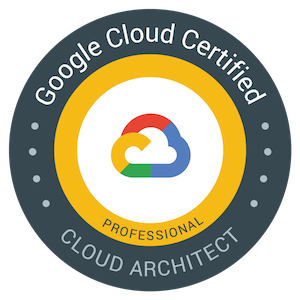

# Learning Notes for Google Cloud Professional Cloud Architect Exam

Here is a collection of technical information related to Google Cloud Platform (GCP) that is relevant for those preparing for the GCP Professional Cloud Architect (PCA) certification exam. It covers a range of topics that are likely to be tested on the exam, including billing and resource management, data processing and management, GKE management, load balancing, connectivity, deployment strategies and so on. As such, it provides a useful resource for those looking to prepare for the PCA exam and gain an understanding of GCP and its services.

*PS: These are personal learning notes based on my own understanding of concepts and topics and inspired by resources provided during my participation in the [GET GCP CERTIFIED Program 2023](https://inthecloud.withgoogle.com/get-cloud-certified/register.html?utm_campaign=622024a2f6b486000121cd20&utm_content=64439acc0a38300001e71e5c&utm_medium=smarpshare&utm_source=linkedin&utm_term=_+Google+Cloud+is+offering+a+special+program+in+2023+where+you+can+get+FREE+training+and+certification+vouchers+for+not+just+one_+but+FIVE+Google+Cloud+exams_+_%0A).*

- [Useful Links](#some-super-useful-links-i-recommend)
- [Books](#if-you-prefer-books-too)

## Cloud Identity vs IAM
- Cloud Identity manages Identities and Privilege but IAM only privileges
- Super Admin (not to be used daily), Org admin (can be used daily)
- Super admin can grant Org Admin role to others but Org admin can only grant IAM roles

## Predefined Roles
- You cannot add or remove abilities to a predefined role.
- Predefined roles are managed by Google unless there is a specific need for a custom role, you should use predefined ones.

## GCP Billing and Resource Management

- On an organization, there is one billing account and all projects under it will be billed to this billing account.
- Labels are key:value pairs that help in searching resources and avoiding duplicates. For example, `env:dev`.
- Tags are only for network resources and can affect operations. For example, you can create firewall rules based on tags.
- Use resource quotas to prevent unexpected spikes in usage. You can set quotas for resources per project and API rate limit requests.
- IAM roles are groups of permissions. Permissions are assigned to roles, and roles are assigned to members. Permissions are never directly assigned to members.
- Google Cloud Directory Sync (GCDS) is used to sync AD users with Cloud Identity. The tool runs on the AD server to perform the sync operations. GCDS is only one-way communication (AD to GCP Identity). If you want two-way communication, use ADFS (AD Federation Service) on GCP.
- IAM policies are collections of bindings, audit configs, and metadata. Bindings contain members, roles, and conditions (whether access is granted based on the context or if a condition is met). For example, you can use IAM policies to grant temporary access to someone in a specific time frame.
- Billing accounts are resources. There are four types of billing account roles: Billing Account Creator (creates billing accounts at the organization level and manages billing), Billing Account Admin (all permissions except for the above), Billing Account User (links projects to billing accounts), and Billing Account Viewer (good for finance teams).

## VMs
- Restoring a VM from a snapshot gives you a new VM with a different IP, by default.
- Privileges always propagate down.
- The effective policy for a resource is the union of the policy set at that resource and the policy inherited from its parent BUT Organizational Policies (e.g. restriction that only resources in some regions can be created) can be overwritten on lower levels.
- Network Bandwidth depends on Compute.
- VMs can have up to 8 NIC, VMs storage (Disk) use Network.
- Startup/Shutdown script can be set at project level too ==> Every VMs in the project will use that.
- SHIELDED VM IS BEST PRACTICE IN GCP.

## Org Policies vs IAM Policies
- Org policies focus on WHAT, IAM policy focuses on WHO.
- Lower level policies can overwrite Org ones, but not in IAM policies (except Deny policies).

## Retention Policy vs Object Versioning
- Retention policies protect from deletion and changes, Object versioning allows modification.
- GCP Object are immutable.

## GCS
- It's best practice to use GCS for Dataproc.

## CloudSQL
- Public IP: good to create an allow list if the client is on the internet or/and use SQL auth proxy.
- Private IP: use Google private service access to connect to your VPC.
- To configure PSA: Allocate IP range or let GCP do it for you, then enable PSA for VPC.
- Use SQL Proxy if the VPC is not peered with PSA.
- A default rule action of "deny" would block all access. So in allow/deny policy default should be allow.

## Cloud Run
- Stateful apps are not currently supported in Cloud Run.
- Migrate to container don't create VMs, only containers.

## GKE
- Private Clusters are definitely a best practice with GKE.
- Having a Private Cluster does NOT mean you can’t expose workloads via Services to the outside world!
- Enable Workload Identity is a best practice for a GKE which needs to access other GCP APIs. and Federation if access is from other K8s (other cloud or on-prem).
- Service Mesh (Istio / Anthos Service Mesh) is often the right choice when advanced traffic management is required, e.g. mutual TLS, Fault Injection, Traffic Splitting, Circuit Breaking, Connection Pooling, etc.
- A node taint lets you mark a node so that the scheduler avoids or prevents using it for certain Pods. A complementary feature, tolerations, lets you designate Pods that can be used on "tainted" nodes. Taints and tolerations work together to ensure that Pods are not scheduled onto inappropriate nodes.

Table 1: Comparison of OLTP and OLAP systems

|             | OLTP              | OLAP        |
|-------------|------------------|-------------|
| **Purpose** | Transactional processing | Analytics and decision support |
| **Data**    | Small, frequently updated | Large, historical |
| **Design**  | ACID & SQL       | SQL (and sometimes NoSQL) |
| **Examples**| Cloud SQL & Spanner | Bigquery   |

## Firestore and Firebase
- Firestore is a NoSQL Database, but Firebase is a development platform with a ton of additional features that uses Firestore.

## Spanner
- Do-It-Yourself still needed to automatically scale Spanner Scale Spanner nodes mostly based on CPU utilization metrics.
- When using Cloud Spanner consider migrating business logic to app code instead of implementing it into DB unlike cloud SQL.
- It's not possible to migrate SQL DB to Spanner without some adjustment to make data fit into Spanner (e.g. data types Business Logic, etc.).

## BigQuery
- It’s a common practice to have a Dataset in one project and perform queries from another one (split billing!).
- View: View is a virtual table defined by a SQL query. When you create a view, you query it in the same way you query a table.
- Query: When a user queries the view, the query results contain data only from the tables and fields specified in the query that defines the view.
- Authorized Views: An authorized view allows you to share query results with particular users and groups without giving them access to the underlying tables.
- Types of apps where you’d consider using Bigtable: recommendation engines, personalizing user experience, Internet of Things, real-time analytics, fraud detection, migrating from HBase or Cassandra, Fintech, gaming, high-throughput data streaming for creating/improving ML models.

## Dataproc
- Main goal: decoupling of storage & compute. As a consequence, you can treat Dataproc clusters as job-specific/ephemeral.
- When thinking about Dataproc, you should really think about per-job, ephemeral, auto-scaling clusters with auto-shutdown after the task is completed.
- Using Spot/Preemptible VMs for secondary Dataproc workers is a common pattern.
- Switching from HDFS to GCS is also a best practice in most cases.

## Security
- Using Service Accounts for firewall rule is a best practice (since it’s more secure).
- In parallel to firewall rules (which you can define only on Project level!), you can also define Firewall Policies (on Org, Folder, or Project level), which increase security and flexibility of controlling network traffic.
- VPC Service control prevents data exfiltration and is good for services which don't support firewall rules (Cloud storage, Bq, etc.).
- Web Security Scanner identifies security vulnerabilities in your App Engine, Google Kubernetes Engine (GKE), and Compute Engine web applications by crawling the app, following all the links.
- Cloud Armor cannot be enabled for HTTPS LB with backend buckets.
- Regional LBs do NOT support GCS buckets as backends.
- Serverless Network Endpoint Groups group serverless backends such as Cloud Run / Cloud Functions / App Engine so they can be reached from a single endpoint (Can leverage https LB on top of that).

## Miscellaneous
- Cloud CDN does not compress or decompress content.
- From PCA exam perspective, it’s worth reading chapters 2, 6, 8 and 17 (1st half) from Google SRE book.
- Looking for Horizontal scaling use Spanner instead of CloudSQL, bigtable also offers HS.
- Spanner can be multi-regional, SQL just dual-region, Bigtable can also be used for analytics purposes, it offers low latency than Bigquery.
- Cloud Storage Transfer service not only works within GCP but also across other cloud and on-prem for large data.
- RPO & RTO:
    - RPO: Combien de temps on peut se permettre de perdre des donnée.
    - RTO: le temps pour un backup d'être Up and Running.

## Cloud DLP
- Cloud DLP for sensitive data protection and classification.

## Connectivity
- Cloud (Dedicated or partner) Interconnect is used to connect to Google Cloud, VPN too.
- For connection to Google Workspaces and Google APIs, Carrier or Direct peering is used.
- Within GCP, VPC peering is used. Unless direct access to Google Workspace is needed, use Cloud Interconnect.

## Security
- Security Group: change group to sec group if you want to apply policies to a group.
- Message digests are used to detect changes in files, a security control that can be used to help detect changes to data.
- Data Catalog is a managed service for metadata.

## Load Balancing
- Connection draining is a process that ensures that existing, in-progress requests are given time to complete when a VM is removed from an instance group or when an endpoint is removed from a zonal network endpoint group (NEG).
- A network endpoint group (NEG) is a configuration object that specifies a group of backend endpoints or services.
- With NEGs, Google Cloud load balancers can serve VM instance group-based workloads, serverless workloads, and containerized workloads. NEGs let you distribute traffic to your load balancer's backends at a more granular level.

## Sole Tenancy
- GCP Sole tenancy is used when you want to run only VMs from the same project on a server and is useful when using BYOL licensing that is based on a per-core or per-processor pricing mode.

## GKE
- In GKE, use Istio to secure individual clusters or enable services in multiple clusters to securely work with each other (traffic management stuff).
- Binary Login in Cloud SQL helps ensure consistency when recovering or restoring data in case of catastrophe.

## Private Service Stuffs
- Private service Connect is used to connect Google API and service using an endpoint in the VPC.

## Private Service Stuffs
- Private service Connect is used to connect Google API and service using an endpoint in the VPC.
- Private service Connect with https is used to connect Google API and service using internal HTTP(S) LB.
- Private Google Access is used to connect external IP addresses and Private Google Access domains to GCP APIs and services through the VPC’s default internet gateway. This private access option is used when GCP resources do not have external IP addresses.
- The Private Service Connect for Published Services is used to connect to services in another VPC without using an external IP address. The service being accessed needs to be published using the Private Service Connect for Service Producers service.

## Data Workflow
- Composer orchestrate Data workflow (ETL pipeline, etc.).
- Cloud workflow orchestrate API driven job or task, and Cloud Scheduler is for cron job.

## BeyondCorp
- BeyondCorp, something like ISE (in terms of visibility) work for GCP, on-prem, and other cloud, use a proxy coupled with IAP to grant access to user based on Device, Identity, and other.

## API
- In terms of API, Cloud Endpoint is good for modern apps, and APIgee for legacy and API monetization.
- Expose ML Model using Vertex AI Endpoint.

## Data Transfer
- To transfer data more than 10TB use transfer appliance.
- Storage Transfer Service is always a preferred method for transfers from other hyperscalers. Also, it allows you to trigger the copy job with a custom frequency.

## IoT
- If required to control IoT devices then use IoT core in front, if just stream data the pub/Sub directly.  
 
## Operations Suite

- Logging is per project and not cross-project. There are two types of logs: Audit logs (admin, system activity, data access) and Agent logs (installed in instances).
- You can filter logs when exporting them. IAM Log Writer grants access to service accounts to create logs.
- Best practice is to create a single project for monitoring.

## a few more details 

- Dataflow can be used to transform and process data before it's loaded into BigQuery.
- Dataprep is used to prepare data for analysis in BigTable and ML.
- VPA (Vertical Pod Autoscaling) can be used to scale pods in GKE. VPA is accessible in the workload view in the GKE console.
- In GKE, Service LB is layer 4 and Service Ingress is the layer 7 LB. NodePort exposes services on nodes' IPs on the same ports on each node. Service "Load Balancer" in GKE uses a routable IP+port to a cloud LB and uses NodePort service to forward traffic to pods.
- Use `gsutil -m` when working with multiple files. Use `gsutil cp -o GSUtil:parallel_composite_upload_threshold=SIZE_IN_BYTES FILE_PATH BUCKET_NAME/OBJECT_NAME` for a single large file.
- GKE Team Fleet Management: A fleet is a group of multiple clusters. A scope is a group of fleet clusters, not all the fleet but some clusters in the fleet. A cluster can be in more than one scope.
- Peering is not primarily for GCP but for Google as a whole (including GCP) and uses public IP addresses. To use private IP addresses, set up Cloud VPN. Peering has direct access to Google but on the public IPs known and published by Google for services like Gmail. The traffic does not pass through the internet, but the destination is still a public address. With peering, we talk about PoP, and with Interconnect, we talk about colocation facilities.
- Interconnect works only with GCP and in a private manner.
- Privilege container is a bad practice, but some workloads may require privilege, so use security context. Specify in the pod spec to run it as a specific user or group member, etc.
- When load balancing with MIG autohealing, two separate health checks are configured: one for LB and another (based on app responsiveness instead of instance running) for autohealing.
- Health check for MIG autohealing and for Load balancer are two distinct things. For autohealing, it is set in MIG configuration, and for LB, it is set in LB configuration.
- Private Google Access is used when you need on-premises resources (through VPN or Interconnect) to communicate privately with Google Cloud services (that cannot have IP addresses) such as Storage Bucket, BigQuery. But it is only used for services that explicitly support PGA. If not, the alternative is Private Service Connect. For serverless enc (compute without server, run, function, App Engine, etc.), use Serverless VPC Access.
- Binary Auth is something that is activated on the environments that run the containers. The scanning and signing are done during the pipeline to attest the images, and it's the Binary Auth that allows or denies the execution of these images on the environments.
- For Cloud Run service distributed across regions (maybe for HA), use Serverless NEG, which will be attached to all those distributed services.
- Deployment strategies: For rolling updates, use `kubectl apply` or `set` command, and we play with a single deployment. For blue/green, use `kubectl patch service` with label selector, and we play with two deployments (apply to deployment), which incurs additional charges.

# some super useful links (I recommend)
- [GCP Flowcharts](https://grumpygrace.dev/posts/gcp-flowcharts/): A collection of flowcharts that help visualize GCP services and their relationships.
- [Case Studies Breakdown](https://www.youtube.com/playlist?list=PLiGDmIpNsrc186jo3qelMAWvRCd2zzk7P): A playlist of videos that cover case studies.
- [Understand case studies](https://youtube.com/playlist?list=PLzS78SLeHQWphBxEusyxksU7-FDBDhj0H&si=tyRCo2CuIxaHTTPF)

# If you prefer books too
- [Official Google Cloud Certified Professional Cloud Architect Study Guide](https://www.google.tg/books/edition/Official_Google_Cloud_Certified_Professi/MRCyDwAAQBAJ?hl=en&gbpv=1&printsec=frontcover): A comprehensive guide to preparing for the GCP Professional Cloud Architect certification exam, written by Google Cloud experts.
- [Professional Cloud Architect Certification Guide: A Comprehensive Guide to Design, Manage, and Secure Enterprise-grade GCP Cloud Solutions](https://www.amazon.com/Professional-Cloud-Architect-Certification-enterprise-grade/dp/1838555277): A guide to preparing for the GCP Professional Cloud Architect certification exam, covering topics such as GCP architecture, security, networking, data management, etc.
- From PCA exam perspective, it’s worth to read chapters 2, 6, 8 and 17 (1st half) from [Google SRE book](https://sre.google/sre-book/table-of-contents/)
